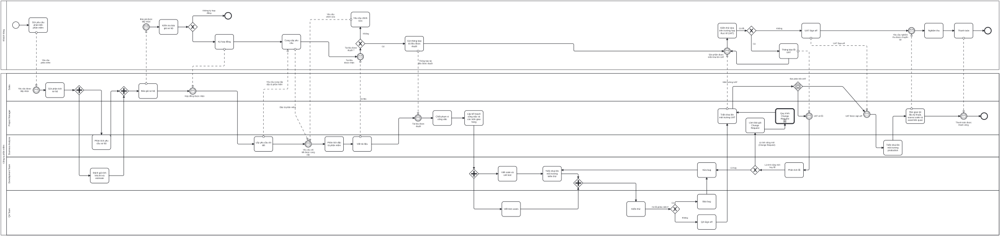

# Nguyễn Thái Hòa - Tiến độ

| Rubik | Tên                                       | Trạng thái     | Link                                                                                                                                        |
| ----- | ----------------------------------------- | -------------- | ------------------------------------------------------------------------------------------------------------------------------------------- |
| 1     | Mô tả quy trình bằng lời                  | Hoàn thành     | [Link](https://docs.google.com/document/d/1sj0qO-C9QNed_lNKlr-mHoXA1vtG-zrsOiuRBxRA0lc/edit?usp=sharing)                                    |
| 2     | Mô hình hóa quy trình phát triển phần mềm | Hoàn thành     | [Link](./do_an_quy-trinh-phat-trien-phan-mem-1.bpmn)                                                                                        |
| 3     | Mô phỏng quá trình khai phá quy trình     | Hoàn thành     | [Link](https://docs.google.com/document/d/15a1mLOpmAmZnEMcfWHvWhDnfLjJxT3OWoosTYUNuNF0/edit?usp=sharing)                                    |
| 4     | Phân tích quy trình                       | Đang thực hiện | [Link](https://docs.google.com/document/d/1Ds3OoV2yS128-fhdYLexw83D3hvbzvLG/edit?usp=sharing&ouid=105859768960007253819&rtpof=true&sd=true) |

## 26 - Jul 2026

- Nghiên cứu rubik điểm
- Bắt đầu triển khai mô hình hóa quy trình phát triển phần mềm

## 27 Jul 2026

- Hoàn thành mô hình hóa quy trình phát triển phần mềm

## 01 Aug 2026

- Hoàn thiện mô hình hóa quy trình phát triển phần mềm (Rubik 2)
- Mô tả quy trình bằng lời (Rubik 1) -> https://docs.google.com/document/d/1sj0qO-C9QNed_lNKlr-mHoXA1vtG-zrsOiuRBxRA0lc/edit?usp=sharing
- Mô phỏng quá trình khai phá quy trình (Rubik 3) -> https://docs.google.com/document/d/15a1mLOpmAmZnEMcfWHvWhDnfLjJxT3OWoosTYUNuNF0/edit?usp=sharing

## 15 Aug 2026

- Review lại nội dung Rubik 1, Rubik 2, Rubik 3
- Chỉnh sửa mô hình trong Rubik 2
- Bản nháp cho Rubik 4: https://docs.google.com/document/d/1Ds3OoV2yS128-fhdYLexw83D3hvbzvLG/edit?usp=sharing&ouid=105859768960007253819&rtpof=true&sd=true