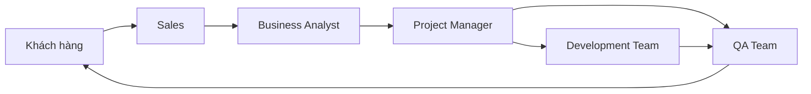
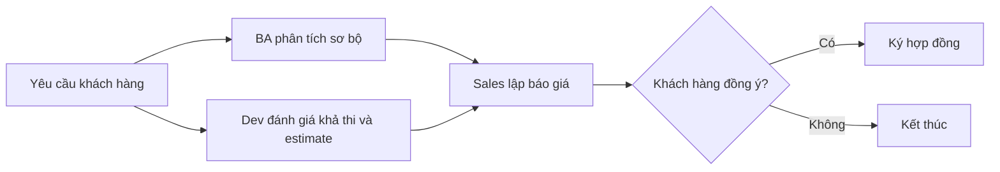
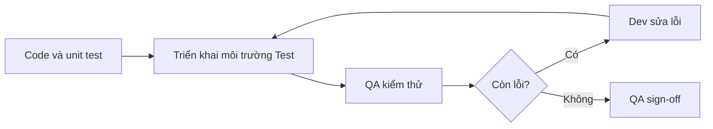
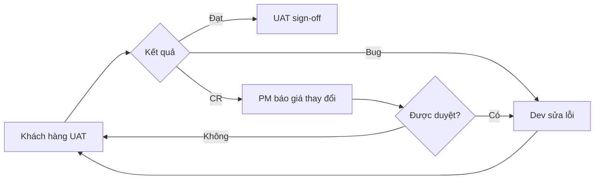
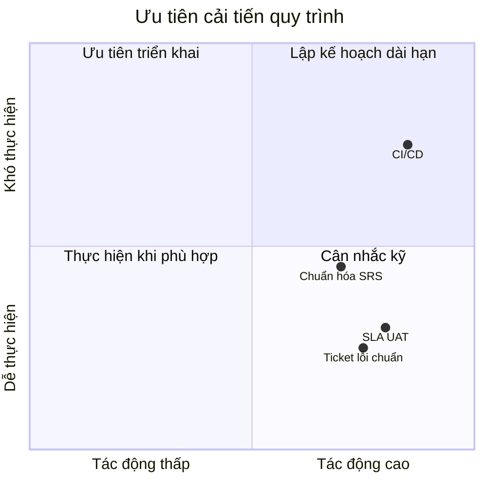
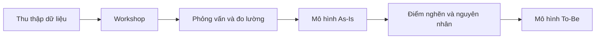

# Nội dung slides: Quy trình phát triển phần mềm

**Phạm vi:** 11 trang, tổng hợp từ mô tả quy trình, mô hình BPMN, khai phá quy trình và phân tích giá trị/lãng phí.

## Checklist thực hiện

- [x] Slide 1 - Tiêu đề và mục tiêu
- [x] Slide 2 - Các tác nhân tham gia
- [x] Slide 3 - Khởi tạo và báo giá
- [x] Slide 4 - Chốt yêu cầu chi tiết
- [x] Slide 5 - Phát triển và kiểm thử nội bộ
- [x] Slide 6 - Nghiệm thu người dùng (UAT)
- [x] Slide 7 - Bàn giao và đóng dự án
- [x] Slide 8 - Các kết quả có thể xảy ra
- [x] Slide 9 - Kết luận và khuyến nghị
- [x] Slide 10 - Phân tích quy trình
- [x] Slide 11 - Mô phỏng khai phá quy trình

---

## Slide 1. Quy trình phát triển phần mềm

**Nội dung chính**

- Mô hình quy trình gia công phần mềm từ tiếp nhận yêu cầu đến đóng dự án.
- Mục tiêu: kiểm soát phạm vi, chất lượng, tiến độ và thanh toán.
- Đối tượng: khách hàng cần phát triển phần mềm và công ty phần mềm thực hiện dự án.

**Hình minh họa đề xuất:** dùng ảnh hoặc sơ đồ BPMN tổng thể `do_an_quy-trinh-phat-trien-phan-mem-1.bpmn`.

## Slide 2. Các tác nhân tham gia

**Nội dung chính**

- **Khách hàng:** cung cấp yêu cầu, duyệt SRS, kiểm thử UAT, ký nghiệm thu và thanh toán.
- **Sales:** tiếp nhận nhu cầu, lập báo giá và ký hợp đồng.
- **BA và PM:** làm rõ yêu cầu, chốt phạm vi, lập kế hoạch và điều phối thay đổi.
- **Dev và QA:** phát triển, kiểm thử, sửa lỗi và triển khai phần mềm.

**Hình minh họa**

## Slide 3. Giai đoạn Khởi tạo và Báo giá

**Nội dung chính**

- Khách hàng gửi yêu cầu; Sales chuyển thông tin để phân tích sơ bộ.
- BA làm rõ bài toán song song với Dev đánh giá khả thi và ước lượng công sức.
- Sales tổng hợp báo giá; khách hàng đồng ý thì ký hợp đồng, từ chối thì kết thúc sớm.

**Hình minh họa**

## Slide 4. Giai đoạn Chốt yêu cầu chi tiết

**Nội dung chính**

- Khách hàng cung cấp tài liệu đặc tả và dữ liệu nghiệp vụ.
- BA phân tích, viết SRS và gửi khách hàng duyệt; cập nhật đến khi được chấp thuận.
- PM đóng băng phạm vi, lập kế hoạch và các mốc bàn giao sau khi SRS sign-off.

**Điểm kiểm soát:** mọi yêu cầu sau khi chốt phạm vi được quản lý như Change Request (CR).

## Slide 5. Giai đoạn Phát triển và Kiểm thử nội bộ

**Nội dung chính**

- Dev viết mã, unit test; QA chuẩn bị test case song song.
- Phần mềm được triển khai lên môi trường test để QA kiểm thử.
- Lỗi được trả về Dev sửa và kiểm thử lại cho đến khi QA sign-off.

**Hình minh họa**

## Slide 6. Giai đoạn Nghiệm thu người dùng (UAT)

**Nội dung chính**

- PM triển khai lên môi trường UAT sau xác nhận của QA; khách hàng dùng thử theo kịch bản thực tế.
- Phản hồi được phân loại rõ: **bug** quay lại Dev sửa, **CR** do PM báo giá và kiểm soát phạm vi.
- UAT sign-off là điều kiện chuyển sang triển khai production.

**Hình minh họa**

## Slide 7. Giai đoạn Bàn giao và Đóng dự án

**Nội dung chính**

- Dev triển khai production theo kế hoạch go-live sau UAT sign-off.
- PM bàn giao source code, tài liệu kỹ thuật và hồ sơ nghiệm thu.
- Khách hàng ký nghiệm thu, thanh toán; dự án chỉ đóng khi xác nhận đã nhận tiền.

**Hình minh họa:** mũi tên `UAT sign-off -> Production -> Bàn giao tài sản -> Nghiệm thu -> Thanh toán -> Đóng dự án`.

## Slide 8. Các kết quả có thể xảy ra

**Nội dung chính**

- **Thành công:** sản phẩm vận hành production, tài sản được bàn giao, thanh toán hoàn tất.
- **Từ chối báo giá:** kết thúc trước hợp đồng, không phát sinh nguồn lực sản xuất.
- **Vấn đề tại UAT:** bug gây vòng lặp sửa lỗi; CR phát sinh thời gian và chi phí bổ sung.
- **Chậm thanh toán:** dự án bị treo ở trạng thái chờ xác nhận, chưa thể ghi nhận đóng dự án.

## Slide 9. Kết luận và khuyến nghị

**Nội dung chính**

- Các cổng kiểm soát quan trọng: ký hợp đồng, SRS sign-off, QA sign-off, UAT sign-off và xác nhận thanh toán.
- Chuẩn hóa biểu mẫu đầu vào, biên bản họp và tiêu chí hoàn thành để giảm hiểu sai.
- Thiết lập SLA phản hồi UAT; chuẩn bị hồ sơ nghiệm thu sớm để hạn chế thời gian chờ.
- Dùng công cụ cộng tác và CI/CD để minh bạch trạng thái và rút ngắn vòng lặp kiểm thử.

## Slide 10. Phân tích quy trình

**Nội dung chính**

- Hoạt động tạo giá trị: phân tích đặc tả, viết code, UAT, triển khai production, bàn giao và thanh toán.
- Hoạt động bắt buộc cho doanh nghiệp: estimate, hợp đồng, chốt phạm vi, kế hoạch, QA sign-off và xử lý CR.
- Lãng phí trọng tâm: trao đổi tài liệu rời rạc, báo bug thiếu thông tin, chờ UAT/thanh toán, test case quá chi tiết.
- Cải tiến: checklist yêu cầu, ticket lỗi chuẩn, SLA UAT 5-7 ngày, buffer 10% cho CR nhỏ và tự động hóa regression test.

**Hình minh họa**

## Slide 11. Mô phỏng quá trình khai phá quy trình

**Nội dung chính**

- Thu thập bằng chứng: hợp đồng, SRS, biên bản nghiệm thu và dữ liệu dự án cũ.
- Tổ chức workshop với Sales, PM, Dev Lead và QA Lead để xác định điểm nghẽn.
- Phỏng vấn nhân sự thực thi và khách hàng; đo các chỉ số: thời gian báo giá, tỷ lệ lỗi UAT, số CR và chi phí rework.
- Vẽ As-Is, đối chiếu bằng chứng, sau đó thiết kế BPMN To-Be và theo dõi hiệu quả cải tiến.

**Hình minh họa**

## Gợi ý trình bày

- Dùng sơ đồ BPMN tổng thể ở slide 1 hoặc phần phụ lục; các slide 3-7 chỉ cắt phần quy trình tương ứng.
- Giữ tối đa 3-4 ý mỗi trang; dùng màu riêng cho Khách hàng, Sales/BA/PM, Dev và QA để dễ theo dõi swimlane.
- Nhấn mạnh các gateway bằng nhãn: `Đồng ý báo giá?`, `SRS được duyệt?`, `Còn lỗi?`, `Bug hay CR?`, `Đã thanh toán?`.
