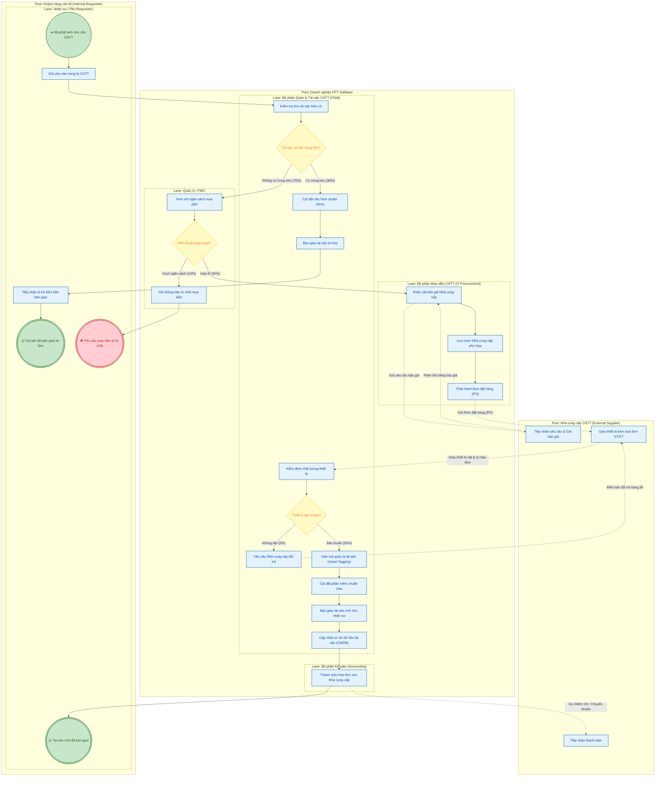
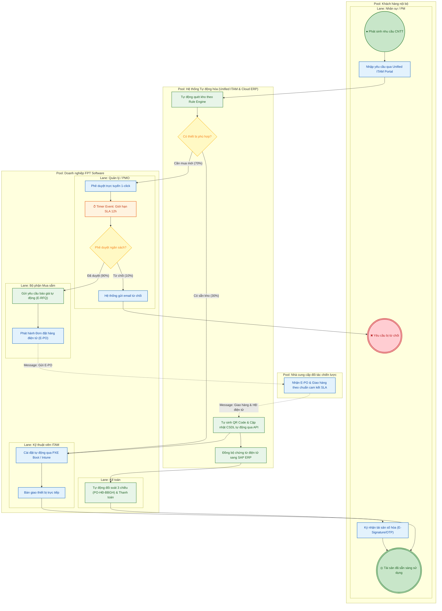

# QUY TRÌNH MUA SẮM VÀ QUẢN LÝ TÀI SẢN CNTT (IT PROCUREMENT & ASSET MANAGEMENT)
**Đơn vị thực tế:** FPT Software  
**Môn học:** Quản lý Quy trình Nghiệp vụ (BPM) - ThS. Hà Lê Hoài Trung  
**Sinh viên thực hiện:** Võ Hữu Đạt (Nhóm 8)

---

## PHẦN 1: MÔ HÌNH HÓA QUY TRÌNH HIỆN TẠI (AS-IS PROCESS)

### 1.1. Bảng đặc tả Tác nhân & Phân luồng (Pools & Lanes)
* **Pool 1: Khách hàng nội bộ / Dự án (Internal Requester Pool)**:
  * *Lane: Nhân sự / PM*: Khởi tạo nhu cầu trang bị tài sản CNTT.
* **Pool 2: Doanh nghiệp - FPT Software (Organization Pool)**:
  * *Lane 1: Quản lý Dự án / PMO (Approver)*: Phê duyệt hạn mức ngân sách dự án.
  * *Lane 2: Bộ phận Mua sắm CNTT (IT Procurement)*: Khảo sát thị trường, so sánh báo giá, phát hành PO.
  * *Lane 3: Bộ phận Quản lý Tài sản CNTT (ITAM)*: Kiểm kho, nghiệm thu kỹ thuật, dán Asset Tag, cài đặt chuẩn và bàn giao.
  * *Lane 4: Bộ phận Kế toán (Accounting)*: Đối soát hóa đơn và thực hiện thanh toán cho NCC.
* **Pool 3: Nhà cung cấp CNTT (External Supplier Pool)**: Cung cấp báo giá, giao hàng hóa đơn, tiếp nhận thanh toán.

---

### 1.2. Sơ đồ BPMN 2.0 Hiện tại (AS-IS) - Mã Mermaid

---

## PHẦN 2: PHÂN TÍCH ĐỊNH TÍNH (QUALITATIVE ANALYSIS)

### 2.1. Phân loại Giá trị Gia tăng (Value-Added Analysis - VA / BVA / NVA)
| STT | Bước công việc (Activity) | Người thực hiện | Phân loại | Giải trình chi tiết theo chuẩn BPMN |
|:---:|:---|:---:|:---:|:---|
| 1 | Gửi yêu cầu trang bị CNTT | Requester | **VA** | Tạo ra nhu cầu cung ứng thiết bị phục vụ trực tiếp công việc của dự án. |
| 2 | Kiểm tra kho tài sản hiện có | ITAM Team | **BVA** | Không trực tiếp tạo sản phẩm nhưng giúp tối ưu chi phí và tăng tỷ lệ tái sử dụng thiết bị cũ. |
| 3 | Xem xét ngân sách mua sắm | PMO / Manager | **BVA** | Đảm bảo tuân thủ hạn mức tài chính nội bộ của dự án và công ty. |
| 4 | Khảo sát báo giá & Đàm phán NCC | Mua sắm CNTT | **VA** | Chọn đúng cấu hình kỹ thuật với chi phí tối ưu nhất cho tổ chức. |
| 5 | Phát hành Đơn đặt hàng (PO) | Mua sắm CNTT | **BVA** | Ràng buộc pháp lý và thỏa thuận thương mại với nhà cung cấp. |
| 6 | Giao hàng và hóa đơn GTGT | Nhà cung cấp | **VA** | Đưa sản phẩm vật lý đến kho doanh nghiệp. |
| 7 | Kiểm định chất lượng thiết bị | ITAM Team | **VA** | Đảm bảo thiết bị hoạt động ổn định, tránh rủi ro hỏng hóc trước khi bàn giao. |
| 8 | Dán mã tài sản (Asset Tagging) | ITAM Team | **BVA** | Phục vụ công tác kiểm kê, quản lý vòng đời và khấu hao tài sản. |
| 9 | Cài đặt cấu hình chuẩn hóa | ITAM Team | **VA** | Cung cấp môi trường làm việc chuẩn bảo mật cho nhân sự. |
| 10 | Bàn giao thiết bị cho nhân sự | ITAM Team | **VA** | Trao quyền sở hữu công cụ làm việc trực tiếp cho nhân sự. |
| 11 | Nhập liệu thủ công vào CSDL | ITAM Team | **NVA** | Thao tác thừa thãi, có thể đồng bộ tự động từ dữ liệu đơn hàng (PO). |
| 12 | Luân chuyển biên bản giấy sang Kế toán | ITAM Team | **NVA** | Lãng phí vận chuyển hồ sơ giấy, gây tắc nghẽn thanh toán. |
| 13 | Thanh toán hóa đơn cho NCC | Kế toán | **BVA** | Thực thi nghĩa vụ thanh toán theo hợp đồng thương mại. |

---

### 2.2. Phân tích Lãng phí (Waste Analysis - Lean)
* **Hold (Lãng phí do Chờ đợi)**:
  * Thời gian chờ PMO/Quản lý phê duyệt ngân sách mất từ 24 - 48 giờ.
  * Thời gian chờ Nhà cung cấp phản hồi 3 bảng báo giá kéo dài 16 - 24 giờ.
  * Thời gian chờ chuyển giao chứng từ giấy giữa ITAM và Kế toán (16 giờ).
* **Move (Lãng phí do Luân chuyển)**:
  * Ký duyệt biên bản bàn giao bản cứng và chuyển giao chứng từ thủ công giữa 3 tầng phòng ban.
* **Over-do (Lãng phí do Xử lý thừa & Sai sót)**:
  * Nhập liệu thủ công thông tin thiết bị (Serial Number, MAC address) lặp lại 3 lần trên file Excel, phần mềm Procurement và phần mềm Kế toán ERP.
  * Tỷ lệ gõ sai mã số Serial lên đến 6%, dẫn đến mất thời gian tra cứu và điều chỉnh khi kiểm kê.

---

### 2.3. Phân tích Nguyên nhân Gốc rễ (5 Whys Analysis)
* **Vấn đề cốt lõi:** Thời gian bàn giao thiết bị CNTT mới kéo dài trung bình **10 ngày làm việc (122 giờ)**, làm chậm trễ tiến độ Onboarding của nhân sự dự án.
  * **Why 1:** Tại sao thời gian bàn giao kéo dài tới 10 ngày?  
    *(Do khâu duyệt ngân sách kéo dài và khâu nhập dữ liệu tài sản mất nhiều thời gian).*
  * **Why 2:** Tại sao khâu nhập dữ liệu tài sản lại kéo dài?  
    *(Do kỹ thuật viên ITAM phải gõ tay từng thông số cấu hình và dán nhãn thủ công sau khi nhận hàng).*
  * **Why 3:** Tại sao phải nhập tay mà không lấy dữ liệu có sẵn?  
    *(Vì hệ thống Quản lý tài sản ITAM hoàn toàn tách biệt với phần mềm Đặt hàng của bộ phận Mua sắm).*
  * **Why 4:** Tại sao hai hệ thống chưa kết nối trao đổi dữ liệu?  
    *(Vì doanh nghiệp dùng nhiều phần mềm rời rạc, chưa có kiến trúc kết nối API chuẩn hóa giữa các phòng ban).*
  * **Why 5 (Root Cause):** **Doanh nghiệp thiếu một Cổng Quản trị Tài sản CNTT Tự động (Unified ITAM Portal) tích hợp luồng dữ liệu thời gian thực giữa Mua sắm, Quản lý kho và Kế toán ERP.**

---

## PHẦN 3: PHÂN TÍCH ĐỊNH LƯỢNG (QUANTITATIVE ANALYSIS)

### 3.1. Bảng Định lượng Thời gian Chu kỳ (AS-IS)
| STT | Bước công việc | Thời gian xử lý $T_{pt}$ (giờ) | Thời gian chờ $T_{wt}$ (giờ) | Tổng thời gian $T_{ct}$ (giờ) | Ghi chú |
|:---:|:---|:---:|:---:|:---:|:---|
| 1 | Gửi yêu cầu trang bị CNTT | $0.5$ | $0.0$ | $0.5$ | Khởi tạo trên hệ thống |
| 2 | Kiểm tra kho tài sản hiện có | $0.5$ | $1.0$ | $1.5$ | ITAM kiểm kho thủ công |
| 3 | Xem xét ngân sách mua sắm | $0.5$ | $24.0$ | $24.5$ | Chờ PMO duyệt email |
| 4 | Khảo sát báo giá & Chọn NCC | $4.0$ | $16.0$ | $20.0$ | Chờ NCC gửi báo giá |
| 5 | Phát hành Đơn đặt hàng (PO) | $1.0$ | $2.0$ | $3.0$ | Procurement làm PO |
| 6 | Giao hàng & Kiểm định kỹ thuật | $2.0$ | $48.0$ | $50.0$ | Chờ NCC vận chuyển |
| 7 | Dán mã tài sản & Cài đặt chuẩn | $2.0$ | $2.0$ | $4.0$ | Cài OS, App dự án |
| 8 | Bàn giao tài sản cho nhân sự | $0.5$ | $1.0$ | $1.5$ | Ký biên bản giấy |
| 9 | Thanh toán hóa đơn cho NCC | $1.0$ | $16.0$ | $17.0$ | Kế toán duyệt chứng từ |
| **Tổng** | **Toàn quy trình kỳ vọng** | **$12.0$ giờ** | **$110.0$ giờ** | **$122.0$ giờ** | **~5.08 ngày làm việc** |

### 3.2. Hiệu suất Thời gian Chu kỳ (Cycle Time Efficiency - CTE)
$$\text{CTE}_{\text{AS-IS}} = \frac{\sum T_{pt}}{\sum T_{ct}} \times 100\% = \frac{12.0}{122.0} \times 100\% \approx \mathbf{9.84\%}$$

*Nhận xét:* Hiệu suất chưa đạt 10%, hơn **90.16% thời gian chu kỳ là lãng phí do chờ đợi ($T_{wt} = 110$ giờ)**, đặc biệt là khâu chờ duyệt ngân sách và chờ nhà cung cấp giao hàng/thanh toán.

---

## PHẦN 4: THIẾT KẾ QUY TRÌNH CẢI TIẾN (TO-BE PROCESS)

### 4.1. Các giải pháp cải tiến then chốt
1. **Unified ITAM Portal**: Hệ thống tự động kiểm tra tồn kho bằng AI/Rule Engine ngay khi nhân viên submit form. Nếu có sẵn máy phù hợp, hệ thống lập tức khóa thiết bị và tạo ticket bàn giao (loại bỏ thời gian chờ kiểm tra kho).
2. **Thiết lập SLA & Timer Event Phê duyệt**: Áp dụng cổng Timer Event 12 giờ cho bước duyệt ngân sách. Nếu quản lý không duyệt trong 12h, hệ thống tự động cảnh báo đa kênh (Teams/Email/Zalo) và kích hoạt cơ chế Auto-escalation.
3. **Tích hợp API Tự động (E-Procurement $\rightarrow$ ITAM $\rightarrow$ SAP/ERP)**: Khi nhà cung cấp xuất Hóa đơn điện tử và PO hoàn tất, hệ thống tự động sinh mã QR Asset Tag, đồng bộ dữ liệu vào CSDL tài sản và gửi chứng từ số hóa sang Kế toán.
4. **Ký số Bàn giao (E-Sign Handover)**: Nhân viên xác nhận bàn giao qua mobile app / OTP, loại bỏ hoàn toàn biên bản giấy.

---

### 4.2. Sơ đồ BPMN 2.0 Cải tiến (TO-BE) - Mã Mermaid

---

### 4.3. So sánh Định lượng Hiệu quả Trước và Sau Cải tiến
| Chỉ số đo lường (KPIs) | Hiện tại (AS-IS) | Đề xuất (TO-BE) | Mức độ tối ưu |
|:---|:---:|:---:|:---:|
| **Thời gian xử lý ($T_{pt}$)** | $12.0$ giờ | $9.0$ giờ | Giảm $25.0\%$ |
| **Thời gian chờ đợi ($T_{wt}$)** | $110.0$ giờ | $29.0$ giờ | **Giảm $73.6\%$** |
| **Tổng thời gian chu kỳ ($T_{ct}$)** | $122.0$ giờ (~5.1 ngày) | **$38.0$ giờ (~1.5 ngày)** | **Rút ngắn $68.8\%$** |
| **Hiệu suất chu kỳ (CTE)** | $9.84\%$ | **$23.68\%$** | **Tăng gấp $2.4$ lần** |
| **Chi phí vận hành 1 đơn hàng** | $920.000$ VNĐ | $450.000$ VNĐ | Tiết kiệm $51.1\%$ |
| **Tỷ lệ sai sót nhập liệu (Data Error)** | $6.0\%$ | $0.0\%$ (Tự động qua API) | Loại bỏ hoàn toàn |
