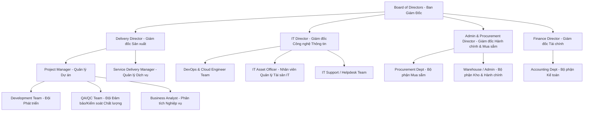

# Tuần 1: Khởi Tạo Phạm Vi Và Bằng Chứng (Scope & Evidence Definition)
**Thành viên thực hiện:** Võ Hữu Đạt - MSSV: 25410188
**Nhóm:** Nhóm 11
**Môn học:** Hệ thống Quản trị Quy trình Nghiệp vụ (BPM) - Trường Đại học Công nghệ Thông tin (UIT)
**Ngữ cảnh doanh nghiệp:** Công ty TNHH Phần mềm FPT (FPT Software) - Lĩnh vực: Phát triển và gia công phần mềm.

---

## 1. Sơ đồ tổ chức giả định (Hypothetical Organizational Structure)
Để hai quy trình **Triển khai & Nghiệm thu (P06)** và **Mua sắm & Quản lý tài sản CNTT (P10)** vận hành trơn tru, FPT Software (FSoft) được giả định tổ chức theo cơ cấu ma trận với các phòng ban liên quan trực tiếp như sau:

---

## 2. Danh sách tác nhân & Vai trò (List of Actors & Roles)

### A. Đối với Quy trình 06: Triển khai và nghiệm thu phần mềm (Deployment & Acceptance)
| Tên tác nhân | Vai trò chi tiết trong quy trình | Phân loại |
| :--- | :--- | :--- |
| **PM / Release Manager** | Khởi tạo yêu cầu triển khai, điều phối các bên, quản lý rủi ro và điều hành cửa sổ triển khai (Deployment Window). | Nội bộ |
| **QA / QC** | Xác nhận báo cáo kiểm thử (Test Report), đánh giá trạng thái lỗi (Defect Status) đảm bảo build đủ điều kiện release. | Nội bộ |
| **DevOps / Release Engineer** | Cấu hình hạ tầng Production, viết/chạy pipeline CI/CD, chuẩn bị backup và chạy rollback nếu xảy ra sự cố. | Nội bộ |
| **Developer** | Tiếp nhận lỗi phát sinh khẩn cấp (Hotfix) trong quá trình nghiệm thu/hypercare và khắc phục tức thì. | Nội bộ |
| **Change Advisory Board (CAB)** | Hội đồng phê duyệt thay đổi (đại diện Ban Giám Đốc) phê duyệt việc đưa hệ thống lên Production. | Nội bộ |
| **Customer Product Owner (PO)** | Người quyết định tối cao việc chấp nhận nghiệm thu (vô điều kiện, có điều kiện hoặc từ chối). | Khách hàng |
| **UAT Users** | Người dùng đại diện phía khách hàng chạy kịch bản thử nghiệm UAT để kiểm định nghiệp vụ phần mềm. | Khách hàng |
| **Operations & Support (L1/L2)** | Bộ phận nhận bàn giao mã nguồn, tài liệu hướng dẫn và tiếp nhận vận hành sau giai đoạn Hypercare. | Nội bộ / Khách hàng |

### B. Đối với Quy trình 10: Mua sắm và quản lý tài sản CNTT (IT Procurement & Asset Management)
| Tên tác nhân | Vai trò chi tiết trong quy trình | Phân loại |
| :--- | :--- | :--- |
| **Requester (Nhân viên / PM)** | Người phát sinh nhu cầu sử dụng thiết bị hoặc bản quyền phần mềm cho dự án, tạo ticket yêu cầu. | Nội bộ |
| **Line Manager** | Quản lý trực tiếp phê duyệt nhu cầu thực tế của Requester. | Nội bộ |
| **IT Asset Officer** | Kiểm tra danh mục cấu hình chuẩn, kiểm tra lượng tồn kho, cập nhật vòng đời tài sản trên CMDB/Asset Register. | Nội bộ (IT Dept) |
| **Procurement Officer** | Liên hệ Vendor lấy báo giá (Quotations), đàm phán hợp đồng, phát hành Đơn đặt hàng (PO). | Nội bộ (Admin Dept) |
| **Finance / Accounting** | Phê duyệt ngân sách theo Cost Center của dự án, thực hiện giải ngân thanh toán và ghi nhận khấu hao. | Nội bộ |
| **IT Support (Technical)** | Thực hiện cài đặt hệ điều hành, cài phần mềm bảo mật chuẩn, dán nhãn Asset Tag và trực tiếp bàn giao máy. | Nội bộ (IT Dept) |
| **Vendor** | Nhà cung cấp thiết bị phần cứng hoặc bản quyền phần mềm ngoài FPT Software. | Bên ngoài |
| **Warehouse Keeper** | Thủ kho tiếp nhận hàng hóa vật lý, kiểm tra sơ bộ số lượng khi bàn giao từ nhà cung cấp. | Nội bộ (Admin Dept) |

---

## 3. Danh mục thuật ngữ (Glossary)
| Thuật ngữ | Định nghĩa đầy đủ | Ngữ cảnh sử dụng |
| :--- | :--- | :--- |
| **UAT (User Acceptance Testing)** | Kiểm thử chấp nhận người dùng. Giai đoạn khách hàng tự kiểm thử phần mềm để quyết định nghiệm thu. | P06 (Nghiệm thu) |
| **SLA (Service Level Agreement)** | Cam kết mức độ dịch vụ về thời gian phản hồi, thời gian xử lý sự cố. | P06 & P10 |
| **Hypercare** | Giai đoạn hỗ trợ đặc biệt và giám sát chặt chẽ ngay sau khi đưa hệ thống Production hoạt động live (thường từ 2-4 tuần). | P06 (Vận hành) |
| **Rollback** | Quy trình khôi phục lại phiên bản phần mềm hoặc hạ tầng trước đó khi bản phát hành mới gặp sự cố nghiêm trọng. | P06 (Triển khai) |
| **CAB (Change Advisory Board)** | Hội đồng thẩm định và phê duyệt các thay đổi lớn đối với hệ thống CNTT đang hoạt động. | P06 (Phê duyệt) |
| **CMDB (Configuration Management Database)** | Cơ sở dữ liệu quản lý cấu hình, lưu trữ thông tin về các tài sản CNTT và mối quan hệ giữa chúng. | P10 (Tài sản) |
| **PO (Purchase Order)** | Đơn đặt hàng. Chứng từ thương mại chính thức gửi đến nhà cung cấp để xác nhận việc mua hàng. | P10 (Mua sắm) |
| **PR (Purchase Request)** | Yêu cầu mua sắm. Chứng từ nội bộ yêu cầu bộ phận mua sắm tiến hành mua trang thiết bị. | P10 (Mua sắm) |
| **Asset Tag / Barcode** | Nhãn dán chứa mã vạch vật lý được dán lên thiết bị để định danh và quản lý kiểm kê. | P10 (Quản lý kho) |
| **Smoke Test** | Kiểm thử nhanh các tính năng cốt lõi nhất nhằm xác nhận build cài đặt thành công và không bị sập (crash) lập tức. | P06 (Kiểm thử) |

---

## 4. Sổ đăng ký bằng chứng nghiệp vụ (Evidence Register)
Dưới đây là danh sách **10 nguồn bằng chứng nghiệp vụ** dự kiến được sử dụng xuyên suốt quá trình thiết kế, đo lường và tối ưu hóa hai quy trình tại FPT Software. Các tài liệu này được phân định rõ ràng giữa **Dữ liệu thật (chính sách, form mẫu chuẩn của FSoft/công nghiệp)** và **Dữ liệu minh họa/Giả lập (dành cho các số liệu vận hành nội bộ nhạy cảm)**.

| STT | Tên tài liệu / Bằng chứng | Loại bằng chứng | Quy trình liên quan | Nguồn gốc / Mô tả dữ liệu | Trạng thái dữ liệu |
| :--- | :--- | :--- | :--- | :--- | :--- |
| 1 | **Biểu mẫu Kế hoạch triển khai (Deployment Runbook Template)** | Mẫu quy trình chuẩn | Quy trình 06 | Tài liệu chuẩn của DevOps FSoft hướng dẫn chi tiết các bước deploy. | **Thật 100%** (Form mẫu chuẩn) |
| 2 | **Biên bản nghiệm thu UAT (UAT Sign-off Template)** | Mẫu biên bản chuẩn | Quy trình 06 | Biên bản pháp lý ghi nhận chữ ký nghiệm thu của Khách hàng PO. | **Thật 100%** (Form mẫu chuẩn) |
| 3 | **Báo cáo kết quả kiểm thử (Test Summary Report)** | Báo cáo kỹ thuật | Quy trình 06 | Tổng hợp số lượng bug, mức độ nghiêm trọng trước khi Golive. | **Minh họa / Giả lập** |
| 4 | **Log CI/CD Pipeline (Jenkins/Azure DevOps)** | Log hệ thống | Quy trình 06 | Log chạy tự động các step build, test, deploy lên môi trường Production. | **Thật 100%** (Dạng log mẫu) |
| 5 | **Biểu mẫu Yêu cầu Mua sắm (Purchase Request Form)** | Biểu mẫu nghiệp vụ | Quy trình 10 | Phiếu đăng ký mua thiết bị mới trên hệ thống ITSM Jira Service Management. | **Thật 100%** (Form mẫu chuẩn) |
| 6 | **Bảng so sánh báo giá (Quotation Comparison Matrix)** | Tài liệu thương mại | Quy trình 10 | Bảng đối chiếu cấu hình, đơn giá và bảo hành của 3 Vendor khác nhau. | **Minh họa / Giả lập** |
| 7 | **Biên bản bàn giao thiết bị (Asset Handover Receipt)** | Biên bản nội bộ | Quy trình 10 | Xác nhận chữ ký bàn giao thiết bị vật lý giữa IT Support và nhân viên nhận máy. | **Thật 100%** (Form mẫu chuẩn) |
| 8 | **Sổ theo dõi tài sản (Asset Register Database)** | Cơ sở dữ liệu | Quy trình 10 | Bảng xuất ra từ phần mềm quản lý Snipe-IT gồm thông tin Asset Tag, Serial, User, Status. | **Minh họa / Giả lập** |
| 9 | **Lịch sử sự cố Hypercare (Incident Log)** | Log lỗi hệ thống | Quy trình 06 | Báo cáo các incident phát sinh trong 2 tuần đầu sau Golive để tính toán chỉ số SLA. | **Minh họa / Giả lập** |
| 10 | **Biên bản thanh lý thiết bị (Asset Disposal Form)** | Biên bản nội bộ | Quy trình 10 | Ghi nhận phê duyệt hủy bỏ hoặc bán thanh lý thiết bị đã hết khấu hao. | **Thật 100%** (Form mẫu chuẩn) |

---

## 5. Kế hoạch hành động tuần tiếp theo (Tuần 2)
Trong tuần tiếp theo (10/08/2026 – 16/08/2026), chúng tôi sẽ triển khai:
- Chi tiết hóa **Mô tả AS-IS của Quy trình 06 (Triển khai & Nghiệm thu)** gồm luồng chính và ít nhất 5 luồng ngoại lệ.
- Thiết lập **Bộ 10 câu hỏi phỏng vấn** định tính và định lượng cho các nhân sự chính (PM, DevOps, Client PO) nhằm thu thập số liệu phân tích giá trị.
- Cập nhật tiến độ trực tiếp vào thư mục `vo-huu-dat/week-02-process-06-description/`.
